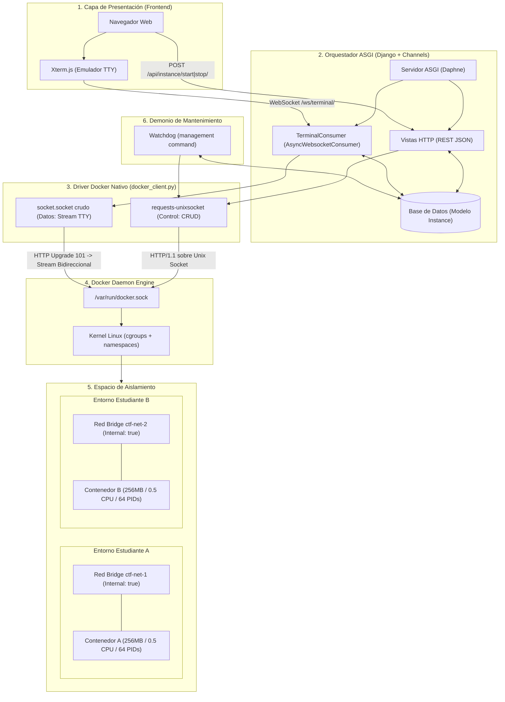

# Arquitectura del Sistema — Plataforma CTF con Contenedores Dinámicos

Este documento describe la arquitectura técnica adoptada para la plataforma CTF, sus componentes, los flujos de datos y la justificación técnica de por qué es la solución más viable, robusta y eficiente para satisfacer los requerimientos planteados.

---

## 1. Contexto y Requerimientos del Proyecto

El objetivo es proveer una plataforma educativa para retos de ciberseguridad (Capture The Flag) donde cada estudiante disponga de un entorno interactivo y aislado bajo demanda, cumpliendo tres pilares obligatorios:

1. **Reto Backend:** Diseñar un orquestador en Django que interactúe **directamente con el socket del daemon de Docker** (sin `docker-py` ni SDKs de alto nivel) para instanciar, aislar y destruir entornos bajo demanda por usuario autenticado.
2. **Reto Frontend:** Integrar **Xterm.js** para ofrecer una consola interactiva en el navegador comunicada mediante **WebSockets bidireccionales** con el contenedor.
3. **Modo Difícil (Resiliencia e Innovación Pedagógica):** Aplicar límites estrictos de recursos (**cgroups, namespaces**) para evitar que un bucle infinito o fork bomb comprometa el host de pruebas, y **destrucción automática por inactividad**.

---

## 2. Diagrama Arquitectónico Global

---

## 3. Estructura de Componentes

### 3.1 Frontend: Xterm.js y División de Planos
- **Plano de Control:** Peticiones asíncronas HTTP (`fetch` con protección CSRF) para arrancar, detener y consultar el estado de la instancia.
- **Plano de Datos:** Conexión WebSocket binaria (`socket.binaryType = "arraybuffer"`). Las pulsaciones de teclas viajan directamente en bytes crudos hacia el proceso sin intermediarios; los eventos de control (como el redimensionado del terminal con `fitAddon`) viajan en tramas JSON de texto (`{"type": "resize", "cols": 80, "rows": 24}`).

### 3.2 Backend: Orquestador Asíncrono (Daphne + Django Channels)
- **Servidor ASGI Daphne:** Permite multiplexar tráfico HTTP estándar y conexiones WebSocket de larga duración sobre un bucle de eventos asíncrono (`asyncio`).
- **TerminalConsumer:** Mantiene vivo el puente entre el WebSocket del navegador y el socket del contenedor. Actualiza la marca temporal `last_activity` con cada interacción del usuario.

### 3.3 Driver Docker: `docker_client.py` (Sin librerías de alto nivel)
- **Operaciones de Control (CRUD):** Usa `requests-unixsocket` para consultar y enviar payloads JSON a los endpoints de la API de Docker (`/networks/create`, `/containers/create`, `/containers/{id}/start`, `/containers/{id}/stop`).
- **Operaciones de Streaming (Socket Hijacking):** Abre un socket nativo de sistema operativo (`socket.socket(socket.AF_UNIX, socket.SOCK_STREAM)`), envía la petición manual `POST /exec/{id}/start` con la cabecera `Upgrade: tcp` y procesa la respuesta HTTP `101 Switching Protocols`. Una vez secuestrada la conexión, el socket transporta el flujo crudo bidireccional (stdin/stdout/stderr) del shell `/bin/sh`.

### 3.4 Seguridad y Aislamiento en el Kernel
- **Aislamiento por Red (Namespaces):** Cada contenedor se asocia a una red bridge dedicada por usuario con `Internal: true`. Al no tener interfaz gateway hacia el host ni reglas NAT hacia internet, el contenedor está física y lógicamente impedido de salir a internet o alcanzar subredes de otros estudiantes.
- **Límites de Recursos (cgroups v2):** Configurados en `HostConfig` al instanciar el contenedor:
  - `Memory`: 256 MB.
  - `NanoCpus`: 500,000,000 (equivalente a 0.5 núcleos de CPU).
  - `PidsLimit`: 64 procesos máximos (inmunidad a *fork bombs*).

### 3.5 Limpieza y Monitoreo: `watchdog.py`
- Proceso autónomo desacoplado que inspecciona periódicamente la base de datos (`Instance.objects.filter(last_activity__lt=cutoff)`).
- Si un estudiante abandona la sesión o cierra el navegador sin destruir la instancia, el watchdog destruye el contenedor y su red asociada, liberando los recursos del servidor.

---

## 4. ¿Por qué es la Arquitectura Más Viable bajo este Contexto?

### A. Cumplimiento Estricto de la Restricción "Sin SDKs" sin Reinventar el Protocolo
- **Alternativa descartada:** Usar `docker-py` o subprocessos del sistema (`subprocess.Popen(["docker", "exec", ...])`).
  - *Problema:* `docker-py` viola el enunciado del reto. Llamar a binarios del sistema mediante `subprocess` abre un subproceso por cada usuario conectado, consumiendo descriptores de archivo del sistema operativo y creando problemas graves de gestión de señales y memory leaks.
- **Solución elegida:** Hablar directamente con el socket Unix `/var/run/docker.sock` vía HTTP/1.1 y Socket Hijacking nativo.
  - *Ventaja:* Es la vía más ligera, no genera subprocesos en el host y aprovecha la API oficial del Docker Engine tal como fue diseñada.

### B. Concurrencia Eficiente con ASGI (Django Channels) frente a WSGI
- **Alternativa descartada:** Django tradicional con WSGI (Gunicorn / uWSGI síncrono).
  - *Problema:* Cada sesión de consola mantiene una conexión persistente abierta durante minutos o u horas. En WSGI sincrónico, cada conexión retiene un worker completo del servidor; con solo 10 estudiantes conectados, el servidor colapsaría por agotamiento de workers.
- **Solución elegida:** Arquitectura ASGI no bloqueante con Daphne y `AsyncWebsocketConsumer`.
  - *Ventaja:* Un único hilo/proceso maneja cientos de conexiones WebSocket concurrentes en modo `asyncio`, reaccionando sólo cuando hay bytes disponibles para leer o escribir.

### C. Redes Internas Nativas vs. Gestión Manual de Reglas de Firewall (iptables / nftables)
- **Alternativa descartada:** Colocar todos los contenedores en una red compartida y configurar reglas de `iptables` por script.
  - *Problema:* Frágil, propenso a errores humanos, requiere permisos de superusuario (`root`) para el orquestador y se desincroniza ante reinicios inesperados del daemon.
- **Solución elegida:** Red bridge individual por usuario con directiva `Internal: true`.
  - *Ventaja:* Docker le instruye al kernel de Linux no crear gateway de salida. La tabla de rutas interna del contenedor queda sin ruta por defecto (`0.0.0.0/0`), garantizando aislamiento total a nivel de red sin tocar manualmente el firewall del host.

### D. Gobernanza por cgroups en el Kernel vs. Monitoreo por Software en el Host
- **Alternativa descartada:** Un script en Python en el host que lea periódicamente el uso de CPU/RAM de los procesos y mate a los infractores.
  - *Problema:* Llega tarde. Un bucle infinito o un script recursivo de memoria puede agotar la RAM del servidor en milisegundos antes de que el script en Python pueda detectarlo.
- **Solución elegida:** Declaración estricta de `HostConfig` (`Memory`, `NanoCpus`, `PidsLimit`) delegada al subsistema cgroups del kernel de Linux.
  - *Ventaja:* Protección en tiempo real por hardware y kernel. Si el contenedor excede los 256 MB, el kernel activa el *OOM Killer* dentro del contenedor; si genera procesos infinitos, `fork()` retorna error inmediatamente. El host de pruebas nunca sufre degradación.

### E. Destrucción Asíncrona Desacoplada (Watchdog) vs. Timers en Memoria
- **Alternativa descartada:** `threading.Timer` o tareas en memoria en el worker de Django.
  - *Problema:* Si el servidor web se reinicia o se despliega una nueva versión, los temporizadores en memoria desaparecen y los contenedores quedan huérfanos indefinidamente consumiendo recursos.
- **Solución elegida:** Persistencia del estado en base de datos (`last_activity`) y barrido periódico mediante un comando de gestión independiente (`python manage.py watchdog`).
  - *Ventaja:* Resiliencia absoluta. Incluso si Daphne o la conexión se caen, el estado persiste y el recolector garantiza la limpieza del entorno.

---

## 5. Cuadro Comparativo de Decisiones Técnicas

| Requerimiento / Reto | Decisión Arquitectónica | Justificación Técnica |
|---|---|---|
| **Interacción con Docker** | Socket Unix directo (`requests-unixsocket` + `socket.socket`) | Cumple la restricción pedagógica sin crear sobrecarga de procesos hijo en el host. |
| **Terminal en Tiempo Real** | Xterm.js + WebSocket + Socket Hijacking | Flujo bidireccional puro de baja latencia con emulación ANSI completa y soporte de resize. |
| **Manejo de Conexiones** | ASGI (Daphne + Channels) | Escalabilidad I/O asíncrona sin bloquear workers para sesiones persistentes. |
| **Aislamiento Multi-usuario** | Red bridge dedicada con `Internal: true` | Ausencia de ruta por defecto; incomunicación total entre estudiantes e internet. |
| **Protección contra Abusos** | cgroups v2 (`Memory`, `NanoCpus`, `PidsLimit`) | Contención a nivel de kernel; protección total contra bucles infinitos y fork bombs. |
| **Gestión de Recursos** | Watchdog autónomo basado en `last_activity` | Limpieza tolerante a fallos y reinicios, evitando contenedores huérfanos. |
