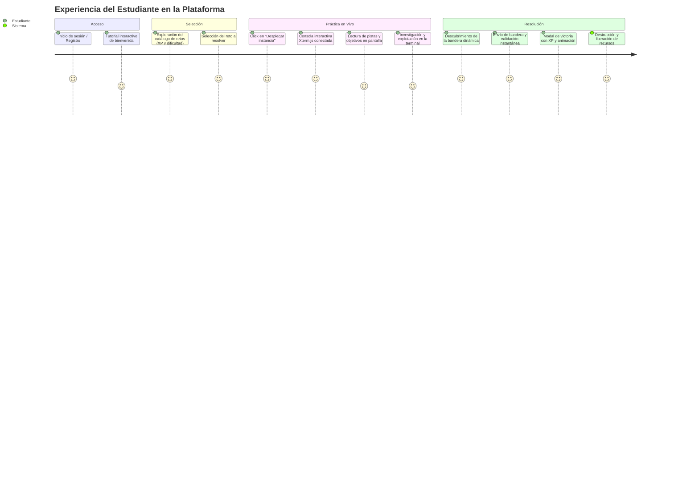
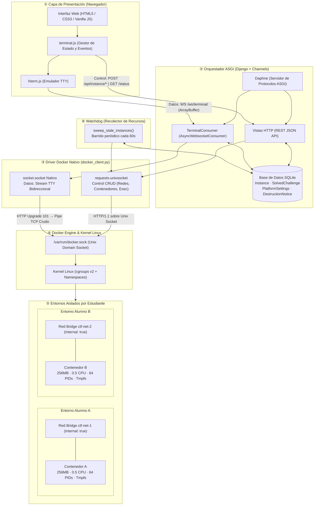
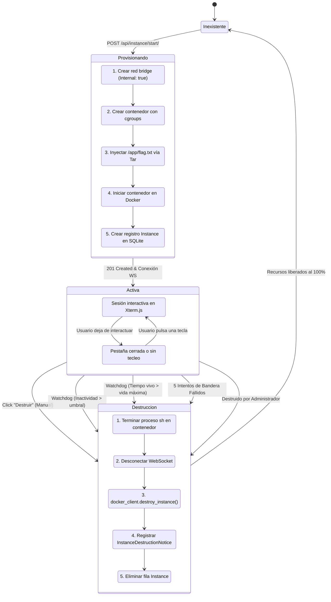
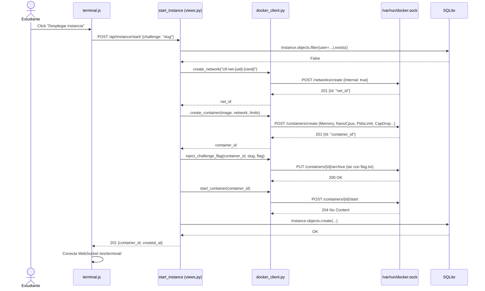
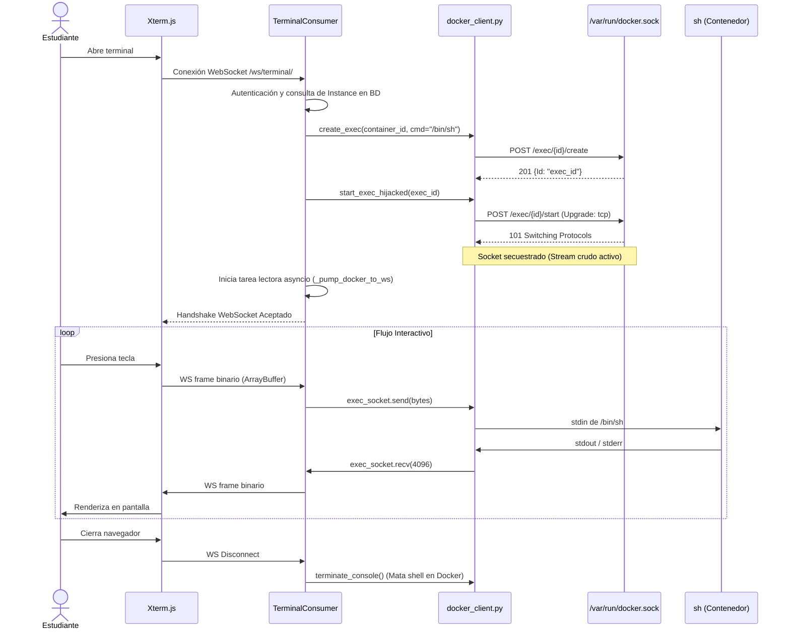
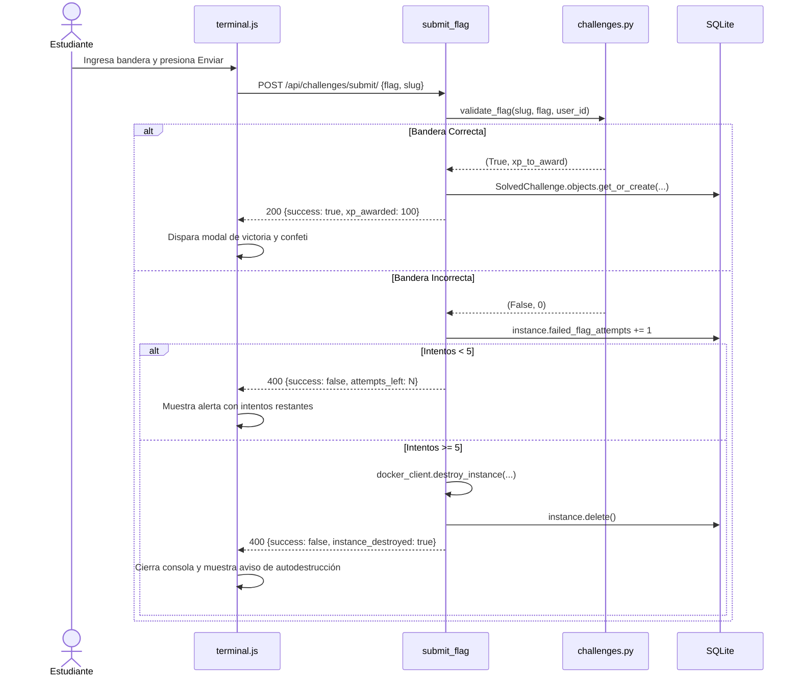
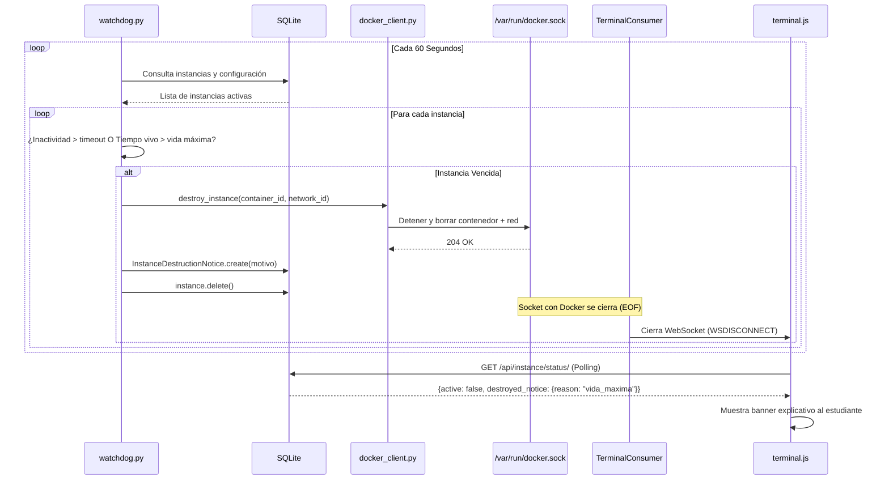

# Arquitectura del Sistema — Plataforma CTF con Contenedores Dinámicos

> **Documento de referencia técnica y funcional.** Describe la visión pedagógica, la arquitectura completa de software, los flujos de interacción entre capas, las garantías de seguridad y el glosario técnico de la plataforma.

---

## 1. Visión Funcional y Pedagógica (Perspectiva No Técnica)

### 1.1 ¿Qué es esta plataforma y qué problema resuelve?
En la enseñanza tradicional de ciberseguridad, los estudiantes practican en laboratorios compartidos o máquinas virtuales estáticas. Esto genera tres grandes problemas:
1. **Interferencia entre alumnos:** Si un alumno rompe un servicio o borra un archivo, arruina el entorno para los demás.
2. **Plagio de soluciones:** Las banderas (*flags*) estáticas se comparten fácilmente entre compañeros.
3. **Consumo descontrolado de hardware:** Los entornos olvidados continúan consumiendo memoria y CPU indefinidamente.

Esta plataforma resuelve estos problemas orquestando **entornos efímeros bajo demanda**: cada estudiante recibe su propio contenedor Docker aislado, con una bandera generada matemáticamente para él, límites estrictos de recursos y un sistema de autodestrucción por inactividad.

---

### 1.2 El Viaje del Estudiante (*User Journey*)



1. **Autenticación y Onboarding:** Al iniciar sesión por primera vez, el estudiante recibe un tutorial interactivo que le explica el funcionamiento de la consola y las reglas del CTF.
2. **Catálogo de Retos:** Visualiza los desafíos clasificados por categoría OWASP, dificultad y puntos de experiencia (XP), junto a su progreso acumulado.
3. **Despliegue con un Clic:** El backend levanta un contenedor en segundos y conecta una terminal embebida en el navegador.
4. **Resolución Guiada:** El panel lateral presenta el objetivo, el primer paso recomendado y el formato esperado.
5. **Victoria y Recompensa:** Al ingresar la bandera correcta, se le otorga XP en tiempo real y la interfaz celebra la resolución. Si comete 5 intentos fallidos consecutivos, la instancia se autodestruye por seguridad.

---

### 1.3 El Rol del Profesor / Administrador
Los usuarios con permisos de staff cuentan con herramientas de supervisión avanzadas:
- **Panel de Control Oculto:** Accesible mediante 5 clics consecutivos en el nombre de usuario (para no saturar la vista del estudiante).
- **Gestión de Tiempos en Caliente (`PlatformSettings`):** Permite modificar los tiempos límites de cada dificultad o el umbral de inactividad en tiempo real sin reiniciar el servidor ni tocar variables de entorno.
- **Detector de Huérfanos y Fantasmas:** Supervisa en vivo los contenedores reales en Docker contra la base de datos para limpiar cualquier inconsistencia.
- **Gestor de Usuarios:** Creación y modificación de cuentas de estudiantes y profesores.

---

## 2. Requerimientos del Sistema y Pilares de Diseño

| Pilar | Requerimiento Técnico | Implementación en el Proyecto |
|---|---|---|
| **Backend** | Orquestador en Django interactuando **directamente con el socket Unix de Docker** (sin librerías intermediarias como `docker-py`). | `requests-unixsocket` para operaciones REST y `socket.socket` crudo para Socket Hijacking. |
| **Frontend** | Emulador de terminal completo en el navegador mediante WebSockets bidireccionales de baja latencia. | `Xterm.js` con addon de auto-ajuste (`FitAddon`) y protocolo binario sobre Django Channels. |
| **Seguridad** | Aislamiento estricto de red y prevención de ataques de denegación de servicio (*fork bombs*, bucles infinitos). | Redes bridge con `Internal: true` (sin salida a internet) y límites en `cgroups v2` (256MB RAM, 0.5 CPU, 64 PIDs). |
| **Resiliencia** | Destrucción automática de entornos huérfanos o abandonados. | Demonio `watchdog` en segundo plano evaluando inactividad y vida máxima. |

---

## 3. Estilo Arquitectónico: Arquitectura en Capas y Separación de Planos

El sistema está diseñado bajo el patrón de **Arquitectura en Capas (Layered Architecture / N-Tier)**, complementado con el principio de **Separación entre Plano de Control y Plano de Datos**.

### 3.1 Descripción de las 4 Capas en Texto Plano

* **Capa 1: Presentación (Frontend / Cliente)**
  * *Tecnologías:* HTML5, CSS3, JavaScript nativo (ES6+) y Xterm.js.
  * *Responsabilidad:* Es la interfaz gráfica que ve el estudiante. Se encarga de capturar las pulsaciones de teclado en el emulador de consola, renderizar los caracteres recibidos en pantalla y ofrecer la interacción para desplegar retos y enviar banderas. No contiene lógica de negocio ni interactúa con Docker.
* **Capa 2: Orquestación y Lógica de Negocio (Backend ASGI)**
  * *Tecnologías:* Django, Django Channels, Daphne y base de datos SQLite.
  * *Responsabilidad:* Es el cerebro central. Valida la sesión del usuario, verifica que cada alumno tenga como máximo un contenedor activo, calcula y valida las banderas dinámicas mediante HMAC, registra el puntaje (XP) y enruta tanto las peticiones web normales como las conexiones de terminal persistentes.
* **Capa 3: Driver y Adaptador de Infraestructura**
  * *Tecnología:* Módulo nativo en Python (`docker_client.py`) utilizando `requests-unixsocket` y `socket` estándar.
  * *Responsabilidad:* Actúa como un adaptador desacoplado. Aísla a Django de los detalles de bajo nivel de Docker. Transforma las órdenes del orquestador en llamadas HTTP crudas y secuestros de socket dirigidos a `/var/run/docker.sock`, cumpliendo el requisito estricto de no usar librerías externas de alto nivel (como `docker-py`).
* **Capa 4: Ejecución y Seguridad en el Kernel**
  * *Tecnologías:* Docker Engine, Namespaces de Linux y cgroups v2.
  * *Responsabilidad:* Es el entorno físico donde corren los retos. Aplica la contención por hardware (máximo 256 MB de RAM, 0.5 núcleos de CPU y 64 procesos) y crea redes virtuales aisladas sin salida a internet para que los estudiantes no puedan atacarse entre sí ni salir del entorno de pruebas.
* **Componente Autónomo de Mantenimiento: El Watchdog**
  * Es un proceso desacoplado que corre en segundo plano cada 60 segundos. Revisa la base de datos y, si detecta que un contenedor superó su tiempo de inactividad o su vida máxima, ordena su destrucción inmediata en Docker para liberar memoria y procesador en el servidor.

---

### 3.2 El Orden de las Capas y Cómo se Conectan (Flujo Paso a Paso)

A continuación se detalla el orden exacto en que viaja la información de capa a capa, tanto para las acciones de control como para el flujo de la terminal en tiempo real:

```
[ Capa 1: Frontend (Navegador) ]
          │  ▲
          │  │  1. HTTP REST (Control) / WebSocket Binario (Terminal)
          ▼  │
[ Capa 2: Orquestador ASGI (Django + Daphne) ]
          │  ▲
          │  │  2. Llamadas a funciones internas en Python
          ▼  │
[ Capa 3: Driver Docker (docker_client.py) ]
          │  ▲
          │  │  3. Unix Domain Socket (/var/run/docker.sock)
          ▼  │     REST sobre socket / HTTP 101 Socket Hijacking
[ Capa 4: Kernel Linux & Docker Engine (Contenedores) ]
```

#### Paso 1: De la Capa 1 (Frontend) a la Capa 2 (Orquestador ASGI)
* **Canal de Control:** El navegador envía peticiones HTTP asíncronas (`fetch`) en formato JSON con la cabecera `X-CSRFToken` hacia las rutas `/api/instance/start/`, `/api/instance/stop/` o `/api/challenges/submit/`.
* **Canal de Datos (Terminal):** El emulador `Xterm.js` abre una conexión persistente `ws://.../ws/terminal/` utilizando tramas binarias (`ArrayBuffer`) para transmitir cada tecla presionada sin procesamientos intermedios.
* **Punto de Recepción:** El servidor **Daphne (puerto 8000)** recibe las conexiones TCP. Si es tráfico HTTP, lo entrega a las vistas estándar de Django (`views.py`); si es tráfico WebSocket, lo deriva a `TerminalConsumer` (`consumers.py`).

#### Paso 2: De la Capa 2 (Orquestador ASGI) a la Capa 3 (Driver Docker Nativo)
* La comunicación entre Django y el driver se realiza mediante **llamadas directas a funciones de Python en memoria** (`import docker_client`), sin dependencias de red interna ni subprocesos del sistema operativo.
* **Para el Despliegue:** La vista `start_instance` invoca sucesivamente a `docker_client.create_network()`, `docker_client.create_container()`, `docker_client.inject_challenge_flag()` y `docker_client.start_container()`.
* **Para la Terminal:** Al conectar el WebSocket, `TerminalConsumer` ejecuta en segundo plano `docker_client.create_exec()` (crea la sesión de shell) y `docker_client.start_exec_hijacked()` (inicia el secuestro del socket).

#### Paso 3: De la Capa 3 (Driver Docker Nativo) a la Capa 4 (Docker Engine y Kernel)
* El driver se comunica con el motor de Docker mediante el archivo de **Unix Domain Socket** del sistema operativo (`/var/run/docker.sock`), evitando la sobrecarga de la pila de red TCP/IP.
* **Para Operaciones CRUD:** La librería `requests-unixsocket` empaqueta peticiones HTTP/1.1 tradicionales directamente sobre el archivo socket (por ejemplo `POST /networks/create` o `POST /containers/create`).
* **Para la Terminal (Socket Hijacking):** Se abre un socket nativo de bajo nivel (`socket.socket(AF_UNIX, SOCK_STREAM)`), se envía la petición `POST /exec/{id}/start` con la cabecera `Upgrade: tcp` y Docker responde con `HTTP/1.1 101 Switching Protocols`. A partir de ese milisegundo, Docker "secuestra" el socket y conecta directamente los descriptores de archivo `stdin` y `stdout` del proceso `/bin/sh` dentro del contenedor con nuestro socket en Python.

#### Paso 4: El Flujo de Retorno (Del Kernel al Estudiante)
1. El proceso `/bin/sh` dentro del contenedor emite texto o colores ANSI a través de su salida estándar (`stdout`).
2. El Docker Daemon transfiere esos bytes al socket Unix secuestrado en la Capa 3.
3. La tarea asíncrona `_pump_docker_to_ws()` del `TerminalConsumer` (Capa 2) lee los bloques de 4096 bytes del socket y los reenvía de inmediato por el WebSocket.
4. El navegador (Capa 1) recibe el frame binario y `Xterm.js` renderiza los caracteres al instante en la pantalla del estudiante.

#### Conexión del Componente Transversal: El Watchdog
* El Watchdog corre como un hilo autónomo cada 60 segundos.
* Se conecta a la **Capa 2 (Base de Datos)** para consultar qué instancias excedieron su tiempo de inactividad o vida máxima.
* Se conecta a la **Capa 3 (`docker_client.destroy_instance`)**, la cual le ordena a la **Capa 4 (Docker Engine)** detener el contenedor, borrarlo y eliminar la red virtual asociada, garantizando que el host nunca acumule basura.

---

### 3.3 Separación de Plano de Control y Plano de Datos

El sistema separa su tráfico en dos canales independientes sobre el mismo servidor:

1. **Plano de Control (HTTP REST):** Se usa para acciones puntuales como iniciar una instancia, destruirla, consultar el estado o enviar una bandera. Viaja con protección CSRF y formato JSON.
2. **Plano de Datos (WebSocket Binario + Socket Hijacking):** Se usa exclusivamente para el flujo de texto de la terminal. Transporta bytes crudos entre el teclado del usuario y el intérprete de comandos (`/bin/sh`) en tiempo real y con latencia mínima.

---

### 3.4 Justificación Técnica: ¿Por qué se eligió esta Arquitectura?

1. **Seguridad y Principio de Mínimo Privilegio:** El navegador del usuario jamás toca Docker directamente. Toda acción pasa obligatoriamente por la capa de orquestación, donde se validan permisos, identidad y cuotas.
2. **Bajo Acoplamiento e Independencia:** Si el día de mañana se cambia la interfaz web por una aplicación de escritorio o CLI, el backend no sufre ningún cambio. Si Docker actualiza su API, solo se modifica el driver de la Capa 3 sin tocar los modelos ni las vistas de Django.
3. **Escalabilidad y Concurrencia:** Al usar Daphne y ASGI en la capa de backend, el servidor no bloquea hilos de ejecución para mantener abiertas las consolas. Un único proceso atiende a decenas de estudiantes conectados al mismo tiempo consumiendo mínimos recursos.
4. **Resiliencia ante Fallos:** Si el navegador de un estudiante se cierra abruptamente, el Watchdog y la base de datos garantizan que ningún contenedor quede olvidado como "huérfano" consumiendo recursos en el servidor.

---

### 3.5 Guion Verbal Recomendado para Exposición en Clase

> *"Nuestra plataforma utiliza una **Arquitectura en Capas**. En la primera capa tenemos el **Frontend con Xterm.js**, que solo se encarga de mostrar la consola y capturar el teclado. En la segunda capa está el **Orquestador en Django con Daphne**, que maneja la autenticación, el puntaje y las reglas del CTF. En la tercera capa creamos un **Driver propio en Python**, que se comunica directamente con el socket de Docker sin usar SDKs de terceros. Y en la cuarta capa está el **Kernel de Linux**, que aplica los límites de memoria, CPU y redes aisladas para que ningún estudiante comprometa el servidor. Además, separamos el tráfico en un **Plano de Control** vía HTTP para gestionar los retos, y un **Plano de Datos** vía WebSockets para transmitir el tecleo de la terminal en tiempo real."*

---

## 4. Vista Global de la Arquitectura



---

## 4. Ciclo de Vida de una Instancia (Máquina de Estados)



---

## 5. Componentes y Mecanismos Técnicos Clave

### 5.1 Frontend: Separación de Planos de Control y Datos
El navegador (`terminal.js` + `Xterm.js`) separa estrictamente sus comunicaciones:
- **Plano de Control (HTTP REST):** Peticiones JSON asíncronas con token CSRF para arrancar, detener y consultar estados.
- **Plano de Datos (WebSocket Binario):** Canal persistente con `socket.binaryType = "arraybuffer"`. Cada tecla se envía como un byte directo sin la sobrecarga de empaquetar JSON. Las instrucciones de control de la consola (como el redimensionamiento con `FitAddon`) se envían en tramas de texto JSON `{"type": "resize", "cols": 80, "rows": 24}` que el servidor intercepta antes de llegar al shell.

---

### 5.2 Backend: Daphne, ASGI y Concurrencia No Bloqueante
- **Daphne (Servidor ASGI):** Multiplexa conexiones HTTP y WebSockets sobre un único bucle de eventos (`asyncio`).
- **`TerminalConsumer`:** Puente asíncrono que lee del WebSocket y escribe en el socket del contenedor. 
- **Optimización de Escrituras (Throttling):** La función `_touch_activity_throttled()` actualiza la marca de tiempo `last_activity` en la base de datos como máximo una vez cada 30 segundos. Esto evita saturar SQLite con escrituras cuando un comando produce cientos de líneas por segundo (ej. `top` o `ls -la /`).

---

### 5.3 Driver Docker Nativo y Socket Hijacking
El archivo `docker_client.py` prescinde de librerías externas hablando directamente con el socket Unix `/var/run/docker.sock`:
1. **Petición con Upgrade:** Envía una solicitud HTTP estándar `POST /exec/{id}/start` con la cabecera `Upgrade: tcp`.
2. **Switching Protocols (101):** El daemon de Docker responde con `HTTP/1.1 101 Switching Protocols`.
3. **Stream Crudo:** A partir de ese momento, la conexión deja de ser HTTP y se convierte en un flujo bidireccional puro de bytes crudos conectado a la entrada/salida estándar del shell `/bin/sh`.

---

### 5.4 Generación de Banderas Dinámicas Antifraude
Para impedir que los estudiantes compartan respuestas:
$$\text{Flag} = \text{"CTF\{" } + \text{HMAC-SHA256}(\text{key}=\text{SECRET\_KEY}, \text{msg}=\text{"slug:user\_id"})[:16] + \text{"\}"}$$
- El backend calcula la bandera única correspondiente al usuario y la inyecta antes de iniciar el contenedor mediante una llamada `PUT /containers/{id}/archive` (subida de tar en memoria).
- La bandera se almacena en el contenedor con permisos restrictivos (`root:root`, modo `0600`), obligando al estudiante a explotar la vulnerabilidad para elevar privilegios y leerla.

---

### 5.5 Seguridad en el Kernel: cgroups v2 y Namespaces
- **Aislamiento de Red:** Cada contenedor tiene una red bridge con `Internal: true`. El kernel no crea puerta de enlace (*default gateway* `0.0.0.0/0`) ni reglas de NAT. El contenedor no puede comunicarse con internet ni con otros contenedores de la red local.
- **Límites de Recursos:**
  - `Memory: 256MB`: Si un proceso intenta consumir más memoria, el **OOM Killer** del kernel termina el proceso infractor sin tocar el sistema anfitrión.
  - `NanoCpus: 500,000,000` (0.5 núcleos): Cuota estricta de CPU para evitar la saturación del host.
  - `PidsLimit: 64`: Inmunidad total contra ataques de tipo *fork bomb* (`:(){ :|:& };:`).
  - `CapDrop: ALL` + `CapAdd: SETUID, SETGID`: Se revocan todas las capacidades del kernel de Linux excepto las indispensables para la separación de privilegios con `sudo`.
  - `Tmpfs /tmp (64m, noexec, nosuid)`: La carpeta temporal vive en memoria RAM y prohíbe la ejecución de binarios.

---

### 5.6 Concurrencia y Resiliencia en la Base de Datos
- **Prevención de Carreras:** El modelo `Instance` utiliza `user = models.OneToOneField(...)`. Si dos peticiones de creación llegan al mismo tiempo, el motor de base de datos rechaza la segunda con un `IntegrityError`.
- **Llamadas Docker fuera de Transacciones:** Las operaciones de creación en Docker se realizan fuera de transacciones SQL para no retener bloqueos de escritura en SQLite. Si la base de datos falla al insertar, el bloque `except` ejecuta una limpieza compensatoria borrando el contenedor recién creado en Docker.

---

## 6. Diagramas de Secuencia Detallados

### 6.1 Despliegue de Instancia (`POST /api/instance/start/`)



---

### 6.2 Sesión de Terminal y Socket Hijacking (`WS /ws/terminal/`)



---

### 6.3 Validación de Banderas y Límites de Intentos (`POST /api/challenges/submit/`)



---

### 6.4 Destrucción Automática por el Watchdog



---

## 7. Cuadro Comparativo de Decisiones Técnicas

| Área de Decisión | Alternativa Descartada | Solución Elegida | Justificación Técnica |
|---|---|---|---|
| **Interacción con Docker** | `docker-py` o `subprocess.Popen(["docker", ...])` | Socket Unix directo (`requests-unixsocket` + `socket.socket`) | Cumple el requerimiento de no usar SDKs; evita la sobrecarga y fugas de memoria de abrir subprocesos en el sistema operativo anfitrión. |
| **Servidor Web y Concurrencia** | WSGI síncrono (Gunicorn tradicional) | ASGI asíncrono (Daphne + Django Channels) | Las terminales mantienen conexiones abiertas durante horas; WSGI bloquearía un worker completo por alumno, colapsando el servidor con pocas conexiones. |
| **Aislamiento de Red** | Red compartida + reglas manuales de `iptables` | Red bridge dedicada por alumno con `Internal: true` | Docker instruye al kernel a omitir la puerta de enlace; se garantiza aislamiento total sin requerir permisos de `root` para manipular el firewall. |
| **Control de Recursos** | Scripts de monitoreo en Python en el host | Reglas de `cgroups v2` en el Kernel (`Memory`, `NanoCpus`, `PidsLimit`) | La contención en el kernel es instantánea por hardware; un script en Python llegaría demasiado tarde ante un ataque de *fork bomb*. |
| **Limpieza de Recursos** | Temporizadores en memoria (`threading.Timer`) | Demonio `watchdog` autónomo respaldado en base de datos | Si el servidor se reinicia, los temporizadores en memoria mueren; el watchdog lee el estado persistido y garantiza la limpieza de contenedores huérfanos. |
| **Prevención de Trampas** | Banderas estáticas idénticas | Banderas dinámicas con HMAC (`user_id` + `slug`) | Cada estudiante posee una bandera matemáticamente única; compartir la solución con un compañero resulta inútil. |

---

## 8. Estructura del Código Fuente

```
contenedores_dinamicos/
├── ctf_platform/
│   ├── asgi.py          # Entrypoint ASGI: multiplexa HTTP y WebSockets
│   ├── settings.py      # Configuración de Django y límites CTF
│   └── urls.py          # Enrutamiento raíz (/api/, /admin/, /)
│
├── ctf/
│   ├── models.py        # Modelos: Instance, SolvedChallenge, PlatformSettings, etc.
│   ├── views.py         # API REST: control de instancias, validación de flags y admin
│   ├── consumers.py     # TerminalConsumer: puente bidireccional WebSocket ↔ Docker exec
│   ├── docker_client.py # Driver Docker nativo sin SDK (REST + Socket Hijacking)
│   ├── watchdog.py      # Lógica del demonio de limpieza automática
│   ├── challenges.py    # Catálogo de retos, cálculo HMAC de flags y validación
│   ├── routing.py       # Enrutador de Channels para /ws/terminal/
│   ├── apps.py          # Arranque del hilo de fondo del watchdog
│   ├── static/ctf/
│   │   ├── terminal.js  # Lógica del cliente: Xterm.js, WebSockets y control
│   │   └── app.css      # Estilos de la plataforma
│   └── templates/ctf/
│       ├── terminal.html# Vista principal del laboratorio y consola
│       └── login.html   # Vista de autenticación
│
├── challenges/          # Dockerfiles y entornos vulnerables de cada reto
│   ├── _base/           # Imagen base endurecida con configuración de sudoers
│   └── {slug}/          # Aplicaciones vulnerables específicas
│
└── docs/                # Documentación técnica y académica
    ├── arquitectura.md  # ← Este documento
    └── soluciones-retos.md
```

---

## 9. Glosario de Términos Técnicos

### Servidor y Arquitectura Web
- **ASGI (Asynchronous Server Gateway Interface):** Estándar moderno de Python que permite a servidores web manejar tráfico HTTP tradicional y protocolos persistentes y asíncronos como WebSockets sobre el bucle de eventos `asyncio`.
- **WSGI (Web Server Gateway Interface):** Estándar tradicional y síncrono de Python para aplicaciones web; cada petición entrante bloquea un hilo de ejecución hasta que se envía la respuesta.
- **Daphne:** Servidor web ASGI de alto rendimiento desarrollado por el proyecto Django Channels, optimizado para gestionar conexiones HTTP y WebSockets concurrentes.
- **Django Channels:** Extensión de Django que amplía las capacidades del framework más allá de HTTP, permitiendo la creación de consumidores asíncronos para WebSockets y protocolos en tiempo real.
- **`AsyncWebsocketConsumer`:** Clase base de Channels que implementa el ciclo de vida de una conexión WebSocket (`connect`, `receive`, `disconnect`) de manera totalmente asíncrona.
- **`database_sync_to_async`:** Decorador de Django Channels que permite ejecutar consultas sincrónicas al ORM de Django dentro de un contexto asíncrono sin bloquear el bucle de eventos principal.
- **Throttling:** Técnica para limitar la frecuencia con la que se ejecuta una operación costosa (por ejemplo, actualizar la base de datos como máximo cada 30 segundos en lugar de hacerlo por cada tecla presionada).

---

### Docker y Kernel de Linux
- **Unix Domain Socket (`/var/run/docker.sock`):** Archivo especial de comunicación entre procesos (IPC) en sistemas Unix que permite al orquestador comunicarse con el demonio de Docker sin incurrir en la sobrecarga de la pila de red TCP/IP.
- **Socket Hijacking (Secuestro de Socket):** Mecanismo de la API de Docker donde una conexión HTTP inicial se actualiza (`Upgrade: tcp`, código HTTP 101) para ceder el control directo del socket a un flujo de datos bidireccional continuo (stdin/stdout/stderr).
- **cgroups v2 (Control Groups):** Característica del kernel de Linux que permite limitar, registrar y aislar el consumo de recursos de hardware (memoria RAM, tiempo de CPU, número de procesos) asignados a un contenedor.
- **Linux Namespaces:** Mecanismo de aislamiento del kernel que separa los recursos del sistema (redes, identificadores de procesos, sistemas de archivos montados) para que los contenedores no puedan verse ni interferir entre sí.
- **OOM Killer (Out of Memory Killer):** Proceso del kernel de Linux que sacrifica procesos cuando la memoria física disponible se agota; en este proyecto actúa dentro del contenedor cuando el estudiante supera los 256 MB asignados.
- **Bridge Network (`Internal: true`):** Red de Docker que conecta contenedores entre sí pero a la cual se le retira la puerta de enlace (*gateway*) predeterminada y las reglas de enmascaramiento NAT, dejándola completamente aislada de internet y del host.
- **Linux Capabilities (`CapDrop`, `CapAdd`):** Desglose granular de los privilegios tradicionales de `root` en permisos individuales; revocar la mayoría (`CapDrop: ALL`) impide que un atacante escape del contenedor o modifique parámetros críticos del kernel.
- **Contenedor Huérfano (*Orphan*):** Contenedor que existe físicamente en el Docker Engine pero cuya fila correspondiente en la base de datos ya no existe.
- **Instancia Fantasma (*Ghost*):** Registro presente en la base de datos de Django que apunta a un identificador de contenedor que ya no existe en Docker.

---

### Emulación de Terminal y Frontend
- **Xterm.js:** Biblioteca JavaScript de código abierto que implementa un emulador completo de terminal en el navegador web con soporte para caracteres ANSI, colores y atajos de teclado estándar.
- **TTY / PTY (Pseudo-Terminal):** Par de dispositivos bidireccionales emulados por software en sistemas Unix que simulan una terminal física, permitiendo el control de flujo de entrada/salida y señales de control como `Ctrl+C`.
- **Códigos de Escape ANSI:** Secuencias especiales de caracteres transmitidas en el flujo de texto que el emulador interpreta para cambiar colores de texto, mover el cursor o limpiar la pantalla.
- **`FitAddon`:** Complemento de Xterm.js que calcula dinámicamente las filas y columnas exactas que caben en el elemento visual del navegador para notificar al proceso `/bin/sh` del contenedor.
- **`ArrayBuffer`:** Estructura de datos en JavaScript utilizada para representar búferes de memoria binaria cruda de longitud fija, ideal para transmitir paquetes de terminal con mínima latencia.

---

### Ciberseguridad y Conceptos CTF
- **CTF (Capture The Flag):** Competición o laboratorio práctico de ciberseguridad donde los participantes resuelven retos técnicos explotando vulnerabilidades para descubrir una cadena de texto secreta llamada bandera (*flag*).
- **HMAC (Hash-based Message Authentication Code):** Algoritmo criptográfico de autenticación de mensajes que utiliza una clave secreta combinada con una función hash (SHA-256) para generar firmas digitales únicas e infalsificables.
- **Bandera Dinámica:** Bandera generada algorítmicamente y de forma única para cada estudiante, garantizando que el texto que resuelve el reto para un alumno no sea válido para otro.
- **Elevación de Privilegios (*Privilege Escalation*):** Técnica donde un usuario con permisos restringidos aprovecha un fallo de configuración o vulnerabilidad para obtener permisos de administrador (`root`).
- **Fork Bomb:** Tipo de ataque de denegación de servicio donde un proceso crea copias infinitas de sí mismo (`fork()`) para agotar la tabla de procesos del sistema operativo.
