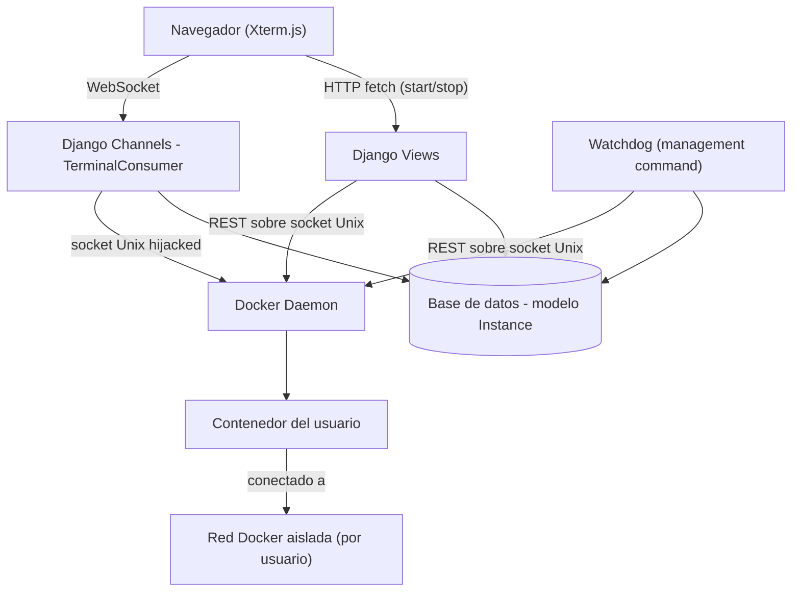
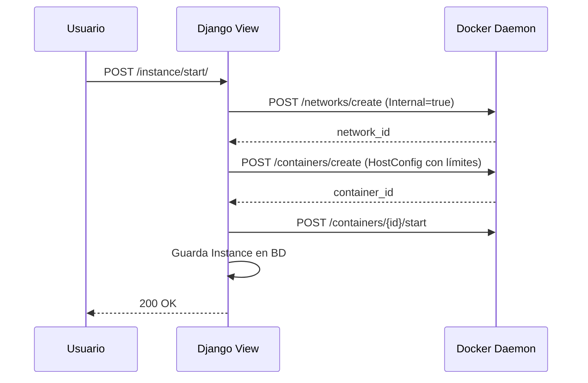
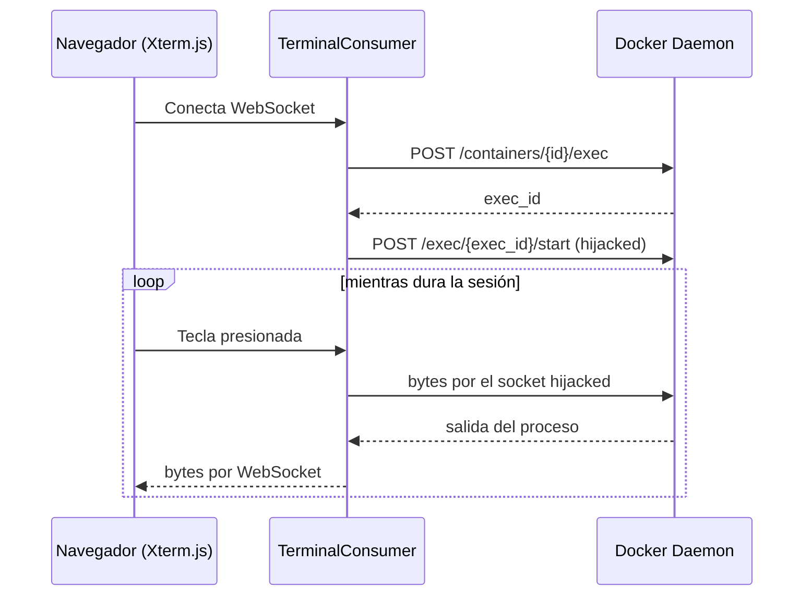
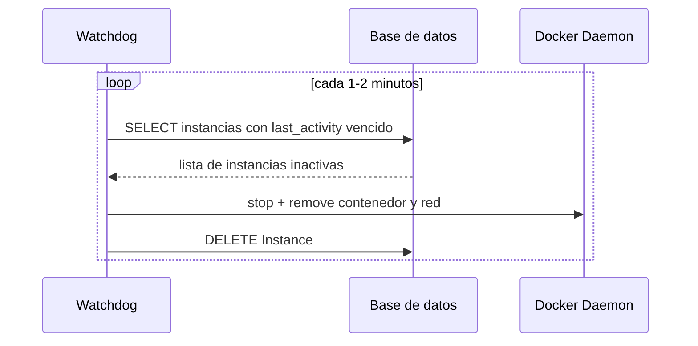

# Documento de Diseño de Software (SDD)
## Plataforma CTF con Contenedores Dinámicos

---

## 1. Objetivo

Diseñar e implementar una plataforma que permita a cada estudiante autenticado
levantar, bajo demanda, un contenedor Docker aislado con un reto de seguridad,
interactuar con él mediante una consola de comandos en el navegador, y que el
sistema destruya automáticamente esa instancia si queda inactiva o si el
estudiante termina.

## 2. Alcance del MVP

Incluido:
- Orquestador backend que crea/destruye contenedores hablando directamente
  con el socket del daemon de Docker (sin SDK `docker-py`).
- Aislamiento de red entre usuarios (una red Docker por usuario).
- Límites de recursos por contenedor (memoria, CPU, número de procesos).
- Consola interactiva en el navegador (Xterm.js) conectada por WebSocket
  al `exec` del contenedor.
- Destrucción automática por inactividad (watchdog).

No incluido en esta primera versión (ver sección 8).

## 3. Arquitectura General

## 4. Componentes

### 4.1 `docker_client.py`
Capa de acceso a la Docker Engine API. Arma las peticiones REST a mano
(vía `requests-unixsocket`) contra `/var/run/docker.sock`. Responsable de:
crear redes aisladas, crear/arrancar/destruir contenedores con límites de
recursos, crear instancias de `exec` y hacer el "hijack" del socket para
obtener un stream bidireccional crudo.

### 4.2 Modelo de datos — `Instance`

| Campo | Tipo | Descripción |
|---|---|---|
| `user` | OneToOneField(User) | Un usuario = una instancia activa como máximo |
| `container_id` | CharField | ID del contenedor en Docker |
| `network_id` | CharField | ID de la red aislada del usuario |
| `network_name` | CharField | Nombre de la red (usado en `NetworkMode`) |
| `created_at` | DateTimeField | Marca de creación |
| `last_activity` | DateTimeField | Se actualiza en cada mensaje del WebSocket |

### 4.3 Endpoints HTTP

| Método | Ruta | Descripción |
|---|---|---|
| POST | `/api/instance/start/` | Crea red + contenedor para el usuario autenticado |
| POST | `/api/instance/stop/` | Destruye contenedor y red del usuario |

### 4.4 Canal WebSocket — `TerminalConsumer`
Ruta `ws/terminal/`. Al conectar: busca la `Instance` del usuario, crea un
`exec` en su contenedor y hace el attach hijacked. Reenvía bytes en ambas
direcciones entre el WebSocket del navegador y el socket del `exec`.
Actualiza `last_activity` en cada mensaje recibido del usuario.

### 4.5 Frontend — Xterm.js
Página estática que abre el WebSocket, escribe en la terminal lo que llega
del servidor y envía al servidor lo que el usuario tipea.

### 4.6 Watchdog
Management command (`python manage.py watchdog`) que revisa
`last_activity` de todas las instancias y destruye (contenedor + red) las
que superan el umbral de inactividad. Pensado para correr en loop o cron.

## 5. Flujos Principales

### 5.1 Iniciar instancia

### 5.2 Sesión interactiva de terminal

### 5.3 Destrucción por inactividad

## 6. Aislamiento y Seguridad

- **Red:** cada usuario recibe una red Docker `bridge` con `Internal: true`
  (sin salida a internet). Al estar en redes distintas, los contenedores de
  usuarios distintos no pueden verse entre sí por defecto.
- **Recursos:** `Memory`, `NanoCpus` y `PidsLimit` en el `HostConfig` al
  crear el contenedor. Docker traduce esto a cgroups internamente; el MVP
  no necesita manipular cgroups a mano.

## 7. Decisiones de Diseño y Trade-offs

| Decisión | Razón | Costo asumido |
|---|---|---|
| `requests-unixsocket` + socket crudo en vez de `docker-py` | Cumple el requisito de hablar directo con el socket | Más código, hijacking manual del exec |
| `InMemoryChannelLayer` en vez de Redis | Suficiente para un solo proceso/demo | No escala a múltiples workers, no sobrevive reinicio |
| `OneToOneField` usuario↔instancia | Simplifica el MVP (una instancia a la vez) | No soporta múltiples retos simultáneos por usuario |

## 8. Fuera de Alcance en este MVP

- Filesystem read-only, `cap-drop`, perfiles seccomp.
- Reconexión automática si se cae el WebSocket.
- Límite global de instancias concurrentes en el servidor.
- Manejo de errores exhaustivo (Docker caído, estados inconsistentes, etc.).

## 9. Stack Tecnológico

- **Backend:** Django, Django Channels, Daphne (servidor ASGI)
- **Comunicación con Docker:** `requests-unixsocket` + `socket` (stdlib) para el hijacking
- **Tiempo real:** WebSocket sobre ASGI
- **Frontend:** Xterm.js (JavaScript vanilla)
- **Orquestación de contenedores:** Docker Engine API (REST sobre socket Unix)
